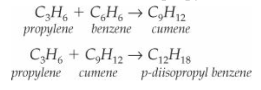

# TeamA2_cheme485_final_project
**Topic: Problems at Cumene Production Facility: Unit 800**  

We are working on **Project 5**

**Assignments for the Planning Report:**

Planning reports are an informal check to make sure students are making adequate progress to finish their final reports. This is our attempt to reduce “busy work” of writing multiple reports. Planning reports will be graded on completion of each component. We will contant teams if we are worried the materials provided don’t reflect adequate progress. Planning reports must include:

**DUE: Wednesday, February 26th**

Planning reports must include:

**1.** A short abstract describing the process. - **Georges**
An overview of the process, what the targets are specified in the problem statement, identification of inputs and outputs, and general descriptions of the major sections of the process. This doesn’t need to be more than half a page in length.

------------------------------------------------------------------------------------------------------------------------------
The Cumene Production Facility buys **propylene** and **benzene** from a manufacturer to produce **cumene** and an undesired product, **p-diisopropyl benzene** (DIPB). The plant goal is to produce **90,000 metric tons per year of 99 wt% purity cumene**. The propylene and the benzene come liquid in the from a manufacturer, and we pump and heat them up to vaporize them since the reaction happens in the **vapor phase**. We will be using cooling water to cool off the product throught a heat exhanger since our reaction is **exothermic**, then the product will be sent into a flash drum. The flash drum will be splitting the product into a gas that will be used for **fuel** for a furnace , and the rest of the liquid will go into a first distillation column. In the first distillation column, we will be separating benzene from the rest of the product. The benzene will be **recycled** and mixed with the manufacturer benzene. The rest of the product from the first distillation column will be sent to a second distillation column. In the second distillation column, cumene will come out from the **distillate** end of the tower with a 99% purity and the waste DIPB will be leaving at the bottom and be used for **fuel** for a furnace. 

**2.** Hand-written block flow diagram of the process. - **Georges**

This can be hand-written and doesn’t need to be made in Visio. No stream tables or equipment tables need be present, but an overall mass balance should be provided.

**3.** Initial data regarding the reaction kinetics necessary for simulations - **Emily**

These are the inputs necessary for a L2 reactor block in Aspen (reaction rates and activation energies). Most projects that are provided will include this reaction data, but if not, you may need to search the patent literature to find these.

The reactions involved in cumene production from benzene and propylene are:

**4.** A suggested thermodynamics package and any extra information that needs to be gathered for the simulation - **Edwin**

Based on the information discussed in class on package selection, students should pick a package appropriate for their system and provide the rationale for doing so.

**5.** An order of magnitude estimate of the design cost. - **Bri**

An order of magnitude cost estimate of the design cost. Order of magnitude estimates of capital costs can be performed if you have information on an existing plant that uses a similar process, but that won’t be the case for most projects. Instead, ignore capital costs and just examine the inputs (raw materials) and outputs (products) on an annual estimate to check that there is a potential for a profit before taking into account other costs.

The cost of inputs and outputs were calcualted with input benzene and propylene (Streams 1 and 2) and output fuel, high-purity cumeme, and waste DIPB (Streams 9, 13, and 14).  
From Table 8.4, the cost of raw materials benzene and propylene were estimated. From Ex. 14.1, the heats of combustion for propane, cumene, and DIPB and average fuel credit were used to quantify the net revenue for sale of fuel in the waste streams.   

The individual pricing of raw materials and the standard heats of combustion for fuel products are summarized in the tables below:   

| Raw materials | Cost  | Unit |
| --------------|-------| ---- |
| benzene 	    | $0.92 | $/kg |
| propylene 	  | $1.44 | $/kg |

| Fuel products  | Heat of Combustion | Unit    |
| -------------- | ------------------ | ------- |
| propane        |	   2.22	          | GJ/kmol |
| cumene 	       |     5.00 	        | GJ/kmol |
| DIPB           |     6.82 	        | GJ/kmol |

Assuming 8000 operating hours per year and neglecting the small fraction of propane contained in the propylene input stream, the annual net profit for this process is approximately $127,110,932.07.   

The spreadsheet with detailed calculations for the order of magnitude cost estimation is provided [here](https://github.com/Antonedw/teamA2_cheme485_final_project/blob/master/project_costing.xlsx)  
