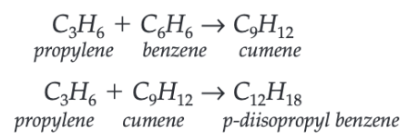

# TeamA2_cheme485_final_project
**Topic: Problems at Cumene Production Facility: Unit 800**  

We are working on **Project 5**

# Planning Report 
**Assignments for the Planning Report:**

Planning reports are an informal check to make sure students are making adequate progress to finish their final reports. This is our attempt to reduce “busy work” of writing multiple reports. Planning reports will be graded on completion of each component. We will contant teams if we are worried the materials provided don’t reflect adequate progress. Planning reports must include:

**DUE: Wednesday, February 26th**

Planning reports must include:

**1.** A short abstract describing the process. - **Georges**
An overview of the process, what the targets are specified in the problem statement, identification of inputs and outputs, and general descriptions of the major sections of the process. This doesn’t need to be more than half a page in length.

----------------------------------------------------------------------------------------------------------------------------
The Cumene Production Facility buys **propylene** and **benzene** from a manufacturer to produce **cumene** and an undesired product, **p-diisopropyl benzene** (DIPB). The plant goal is to produce **90,000 metric tons per year of 99 wt% purity cumene**. The propylene and the benzene come liquid in the from a manufacturer, and we pump and heat them up to vaporize them since the reaction happens in the **vapor phase**. We will be using cooling water to cool off the product throught a heat exhanger since our reaction is **exothermic**, then the product will be sent into a flash drum. The flash drum will be splitting the product into a gas that will be used for **fuel** for a furnace , and the rest of the liquid will go into a first distillation column. In the first distillation column, we will be separating benzene from the rest of the product. The benzene will be **recycled** and mixed with the manufacturer benzene. The rest of the product from the first distillation column will be sent to a second distillation column. In the second distillation column, cumene will come out from the **distillate** end of the tower with a 99% purity and the waste DIPB will be leaving at the bottom and be used for **fuel** for a furnace.  
Recently, the company switched their supplier of propylene which is supposed to follow some speciifcations that applied to the previous supplier. Unfortunately, the production experienced an **8% drop in their production in cumene** due to the 8% increase in their reflux rate in order for them to maintain their 99% purity level requirement.

----------------------------------------------------------------------------------------------------------------------------
**2.** Hand-written block flow diagram of the process. - **Georges**

This can be hand-written and doesn’t need to be made in Visio. No stream tables or equipment tables need be present, but an overall mass balance should be provided.

----------------------------------------------------------------------------------------------------------------------------

----------------------------------------------------------------------------------------------------------------------------
**3.** Initial data regarding the reaction kinetics necessary for simulations - **Emily**

These are the inputs necessary for a L2 reactor block in Aspen (reaction rates and activation energies). Most projects that are provided will include this reaction data, but if not, you may need to search the patent literature to find these.

----------------------------------------------------------------------------------------------------------------------------
The reactions involved in cumene production from benzene and propylene are:

 

The first reaction involves cumene production from propylene and benzene, while in the second the cumene and propylene react to form DIPB. Since cumene is our desired product, and DIPB is an environmental and health hazard, it is important to know the reaction kinetics, so that we may manipulate the environment to favor the cumene production reaction.

Each reaction has an independent rate, dependent on the molar concentration of each reactant and an individual reaction rate constant 'ka', where a denotes which reaction we are referring to.  

**In reaction 1, the cumene production reaction, the rate is:**

r1 = k1 * Cpropylene * Cbenzene.   

where  
k1 = 3.5*10 4*e(-24.90/RT)  

  

where   

with   being in kcal/mol.    

In reaction 2, the DIPB production reaction, the rate is:  

r2 = k2 * Cpropylene * Ccumene.

where  

k2 = 2.9*106*e(-35.08 / RT)  

Which tells us the activation energy is 35.08 kcal/mol.

**In reaction 2, the p-diisopropyl benzene production reaction, the rate is:**

  

where  

with   being in kcal/mol. 

The differences in activation energies and the concentrations on which each reaction is dependent make it possible to favor reaction one by decreasing inlet energy (to ensure the activation energy for two is not reached) or supplying a high concentration of benzene, which is useless in reaction 2 but necessary in reaction 1.  

The units of the rates are mol/g cat-sec. These indicate that the reaction also depends on the weight of the phosphoric acid catalyst present in the reactor. This catalyst is supported on kieselguhr to maximize activity and surface area. For the shell and tube configuration used at the plant, the void fraction of catalyst is 0.5, the particle density is 1600 kg/m3, and the particle diameter is 3 mm. 
the heat transfer coefficient from packed bed to tube wall, 'h,' is 60 W/m2 

The units of the rates are mole/ g cat * sec. These indicate that the reaction also depends on the weight of the phosphoric acid catalyst present in the reactor. This catalyst is supported on kieselguhr to maximize activity and surface area. For the shell and tube configuration used at the plant, the void fraction of catalyst is 0.5, the particle density is 1600 kg/m^3, and the particle diameter is 3mm. The heat transfer coefficient from packed bed to tube wall, 'h,' is 60 W/m^2 * C. 

----------------------------------------------------------------------------------------------------------------------------
**4.** A suggested thermodynamics package and any extra information that needs to be gathered for the simulation - **Edwin**

Based on the information discussed in class on package selection, students should pick a package appropriate for their system and provide the rationale for doing so.

All information is taken **Don't Gamble with Physical Properties for Simulations**

----------------------------------------------------------------------------------------------------------------------------
Four factors that we must take into consideration when selecting thermodyanmic models/packages are: nature or properties, composition of mixture, the pressure and temperature range, and parameter availability.  
We would first go off the basis of the chemicals that are present in the process which include: Propylene, Benzene, Cumene, Propane, and p-diisopropyl benzene. Some notable operating conditions that these components will experience are temperatures 25-350 degrees celsius and pressures up to 31.25 bar. Although all compounds are hydrocarbons, they still do posses some degree of polarity, therefore not allowing for "All-Polar" packages suchs as Peng-Robinson, Redlich-Kwong or Chao-Seader.   Rather we assume we have polar components and that we have mixture containing no electrolytes. Additionally given that pressures we are working with exceed 10 bar, and that interaction parameters (extra information needed) were found readily through a quick google search, the reccomended package is:   

- **Redlich-Kwong-Soave with WS**  

----------------------------------------------------------------------------------------------------------------------------
**5.** An order of magnitude estimate of the design cost. - **Bri**

An order of magnitude cost estimate of the design cost. Order of magnitude estimates of capital costs can be performed if you have information on an existing plant that uses a similar process, but that won’t be the case for most projects. Instead, ignore capital costs and just examine the inputs (raw materials) and outputs (products) on an annual estimate to check that there is a potential for a profit before taking into account other costs.

----------------------------------------------------------------------------------------------------------------------------
The cost of inputs and outputs were calcualted with input benzene and propylene (Streams 1 and 2) and output fuel, high-purity cumeme, and waste DIPB (Streams 9, 13, and 14).  
From Table 8.4, the cost of raw materials benzene and propylene were estimated. From Ex. 14.1, the heats of combustion for propane, cumene, and DIPB and average fuel credit were used to quantify the net revenue for sale of fuel in the waste streams.   

The individual pricing of raw materials and the standard heats of combustion for fuel products are summarized in the tables below:   

| Raw materials | Cost  | Unit |
| --------------|-------| ---- |
| benzene 	    | $0.92 | $/kg |
| propylene 	  | $1.44 | $/kg |

| Fuel products  | Heat of Combustion | Unit    |
| -------------- | ------------------ | ------- |
| propane        |	   2.22	          | GJ/kmol |
| cumene 	       |     5.00 	        | GJ/kmol |
| DIPB           |     6.82 	        | GJ/kmol |

Assuming 8000 operating hours per year and neglecting the small fraction of propane contained in the propylene input stream, the annual net profit for this process is approximately $127,110,932.07.   

The spreadsheet with detailed calculations for the order of magnitude cost estimation is provided 
[here](https://github.com/Antonedw/teamA2_cheme485_final_project/blob/master/project_costing.xlsx)  

----------------------------------------------------------------------------------------------------------------------------
# PFD

**PFD and Stream Table**

**Equipment Summary** Emily  
 

**Aspen PFD**

  
----------------------------------------------------------------------------------------------------------------------------

***Assignments for the Final Report***  

**Letter of Transmission**  
Directions: This is a memorandum (if internal) or a letter (if external) to the appropriate person identifying the report. Teh report is actually an enclosure to this letter. Remember to refer to teh original memorandum or problem statement. In order to get the reader’s attention, writing several sentences summarizing the bottom line is essential. You should always sign or initial this memo or letter. This letter stands alone. It contains no figures or tables, and does not reference any figures or tables contained within the report.

**Title page**  
title, names, class name and date

**Abstract or Executive Summary**  
Directions: Either an abstract or an executive summary should convey to the reader, in a rapid and concise manner, what you did, what you conclude, and what you recommend. This is for the reader who may not read any further or for the reader who is deciding whether or not to read any further. Summarize the bottom line; do not discuss computational details unless they are unique and applicable beyond the report at hand. In an executive summary (but not in an abstract), do not be afraid to use a few well chosen graphs, pie charts or histograms to emphasize your important points, but choose these wisely in order to keep the length of the executive summary down.

These instructions suggest that the contents of the abstract and letter of transmittal are similar. Since both sections are supposed to provide a summary of important conclusions, there will be significant repetition of content. The abstract usually contains more information than the letter of transmittal.

**Table of Contents**  
This is only necessary for longer reports. At the top of the page, the proper title is “Contents,” not “Table of Contents.” Regardless of whether you include a table of contents, all pages of your report should be numbered, preferably at the top right corner or top center (the latter permits easy two-sided copying). Number, indent, or otherwise indicate sections, subsections, etc.

**Introduction**  
This is for the reader who continues past the abstract. The introduction is a one or two paragraph summary of what was assigned, what was done, and, (very briefly) how it was done. A summary of the constraints on the problem is appropriate, as well as some perspective on the specific problem in the context of the larger business picture. There should be no results or conclusions in the Introduction section.

**Results**  
The following are essential components of a results section:

*Labeled and dated process flow diagram (PFD).
Stream flow tables. These must include temperature, pressure, phase, total mass flow rate, total molar flow rate, and component molar flow rates for each numbered stream.
Manufacturing cost summary. Yearly revenue and expense (income from product sales, expenses for raw materials, utilities [itemized], equipment costs if calculated as an annual cost, personnel, etc.) must be included.
Investment summary. The cost to build and install plant now (if appropriate to goals of the problem). This should be itemized by piece of equipment.
Equipment summary. A listing of equipment to be purchased and installed, with specifications required. This could be combined with 4. if not too long.*  

**Capital Costs**

The Direct Capital Costs (CD) is $113.1 million/year, with raw materials consisting of over 90% of the total. The full estimated breakdown of the Direct Capital Costs is shown in Table #. Estimation was conducted according to Table 8.2 in Turton. Further breakdowns of raw materials and utilities are in Tables 2 and 4 below. The prices for materials are from ICIS and utility prices from Turton and are assumed to be 2012 values.   

*Table 1. Cost factors for capital costs.*  
   

The table below include pricing for all streams entering or leaving the process as a whole. The first three are reactant streams containing propylene/propane and benzene which equate to raw material costs. This accounts for the majority of direct capital costs. The following two rows are products streams which are revenue producing. Revenue per annum for the cumene production facility is $155 million which demonstrates that the process is both feasible and profitable.  

*Table 2. Annual material costs and prices of reactants and products. Propylene, propane, and benzene are costs, and cumene is a profit.*  
   

Although raw material costs and revenue of the overall process can be approximated using input and product streams alone, the fuel gas product stream acts as fuel for the furnace, thus cost savings are realized by analyzing the production of fuel gas. The full breakdown of each fuel component and their heat of combustion is provided in Table 3. The price per kilogram was calculated using the heats of combustion multiplied by a fuel credit of $2.50/GJ of each component. The heats of combustion and molecular weights are sourced from NIST Webbook. Therefore, the last column in Table 3 is subtracted from the utility costs for the furnace on-site since that amount of fuel would not need to be outsourced to run that equipment at the facility.   

*Table 3. Annual fuel recovery costs and heats of combustion for materials. Products in streams 9 and 14 are recycled as fuel for the cumene production facility.*
   

Table 4 below depicts utility costs for relevant equipment. H-801 uses natural gas, but this partially accounted for using fuel gas credit from distillate from T-801 and impurities from the flash unit V-802 (refer to Table 3). The reboilers all use either medium- or high-pressure steam while pumps require electricity. Coolers require cooling water. All utility prices are from Turton and are assumed to be 2012 values. 

*Table 4. Annual utility costs for selected equipment.*  
   

The total manufacturing costs without depreciation, COMd can be estimated by adding three categories together: CRM, CUT, and COL.   

COMd = 0.18*FCIL + 2.76(COL + 1.23(CUT + CWT + CRM)  

Solving for COMd using the information in Table 1, a value of $138 million is obtained. This approximation indicates that direct capital costs account for over 80% of the manufacturing costs. The COMd does not take the estimating factors from Table 1 into account, but raw materials and utilities account for a large portion of total costs, thus the COMd is generally insensitive to these estimating factors.   

**Fixed Capital Investment**

The Fixed Capital Investment (FCIL) for the project is expected to be $30 million. This was calculated by multiplying the sum of the Total Module Cost (CTM) and half the Bare Module Cost (CBM) by the Lang Factor of a fluid processing plant, FLang = 4.74. The Bare Module Cost is calculated in Table 5 below, which shows the equipment in the plant, the purchase cost, and CBM. CAPCOST was used to price equipment, using the CEPCI for 2010, which is 551.  

*Table 5. Purchase and bare module cost for all major equipment.*  
   
The total CBM is just below $3.8 million which yields a CTM of approximately $4.4 million. This gives an FCIL of $ 30 million.  

**still need to CAPCOST s the addition of new equipment after modifications are made 

**Discussion**  
Now you go into more detail. This section is for the reader who still wants more information and is willing to read still further. Here you discuss the reasons for making choices and the reasons for discarding alternatives. This is where you discuss any optimization that was done. You might also discuss non routine or unique computational aspects

**Conclusions**  
Nothing new is presented in this section. You should reiterate your important conclusions, which may have already been stated in the abstract, the executive summary, and/or the letter of transmittal. Usually these will involve dollars and process modifications. Be concise and clear; avoid lengthy paragraphs. Once again, remember the bottom line!

**Recommendations**  
This section includes recommendations for further action and/or further study. If there are few conclusions and recommendations, these two sections can be combined. Avoid recommendations that are “pie in the sky,” like finding a better catalyst.

**References**  
